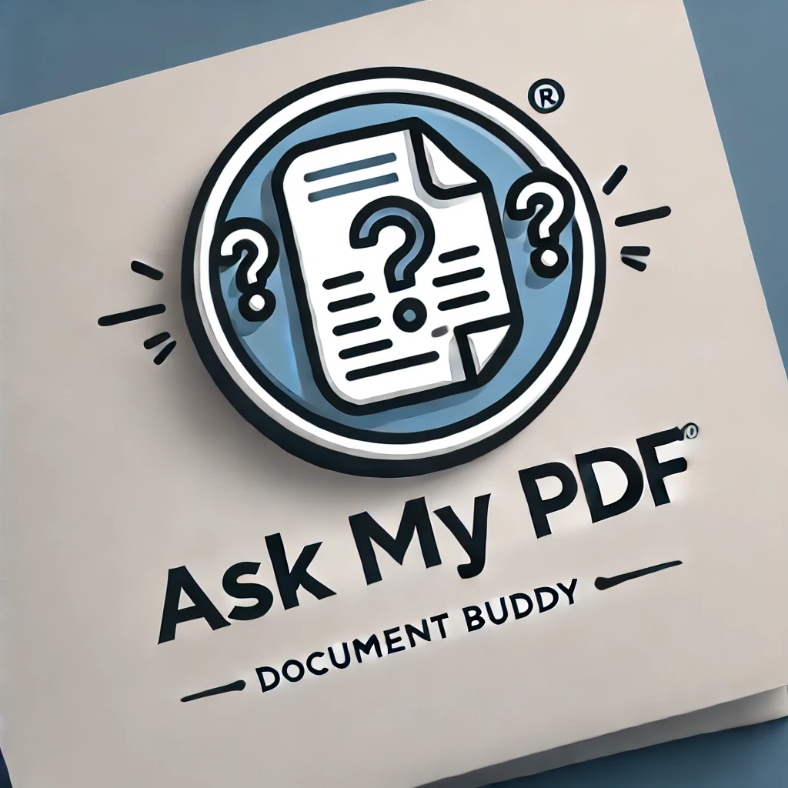

# 📄 ASK-MY-PDF



**ASk MY PDF** is a powerful Streamlit-based application designed to simplify document management. Upload your PDF documents, create embeddings for efficient retrieval, and interact with your documents through an intelligent chatbot interface. 🚀

## 🛠️ Features

- **📂 Upload Documents**: Easily upload and preview your PDF documents within the app.
- **🧠 Create Embeddings**: Generate embeddings for your documents to enable efficient search and retrieval.
- **🤖 Chatbot Interface**: Interact with your documents using a smart chatbot that leverages the created embeddings.
- **📧 Contact**: Get in touch with the developer or contribute to the project on GitHub.
- **🌟 User-Friendly Interface**: Enjoy a sleek and intuitive UI with emojis and responsive design for enhanced user experience.

## 🖥️ Tech Stack

The Document Buddy App leverages a combination of cutting-edge technologies to deliver a seamless and efficient user experience. Here's a breakdown of the technologies and tools used:

- **[LangChain](https://langchain.readthedocs.io/)**: Utilized as the orchestration framework to manage the flow between different components, including embeddings creation, vector storage, and chatbot interactions.
  
- **[Unstructured](https://github.com/Unstructured-IO/unstructured)**: Employed for robust PDF processing, enabling the extraction and preprocessing of text from uploaded PDF documents.
  
- **[BGE Embeddings from HuggingFace](https://huggingface.co/BAAI/bge-small-en)**: Used to generate high-quality embeddings for the processed documents, facilitating effective semantic search and retrieval.
  
- **[Qdrant](https://qdrant.tech/)**: A vector database running locally via Docker, responsible for storing and managing the generated embeddings for fast and scalable retrieval.
  
- **[LLaMA 3.2 via Ollama](https://ollama.com/)**: Integrated as the local language model to power the chatbot, providing intelligent and context-aware responses based on the document embeddings.
  
- **[Streamlit](https://streamlit.io/)**: The core framework for building the interactive web application, offering an intuitive interface for users to upload documents, create embeddings, and interact with the chatbot.

## 📁 Directory Structure

ASK-MY-PDF/
```
├── app.py
├── Attention Is All U Need.pdf
├── chatbot.py
│── logo.png
├── README.md
├── requirements.txt
├── vectors.py
```
Here’s the updated setup with **Step 5** added for installing and running **Ollama with Llama 3.2** on Windows. 🚀  

---

## **🚀 Getting Started**  

Follow these instructions to set up and run the **Ask-My-Pdf App** on your Windows machine.  

### **1. Clone the Repository**  
```bash
git clone https://github.com/Ganesh2409/ASK-MY-PDF.git
cd ASK-MY-PDF
```

### **2. Create a Virtual Environment**  
Use Python’s `venv` for managing dependencies.  

#### **On Windows**  
```bash
python -m venv venv
```
Activate the virtual environment:  
```bash
cd venv\Scripts\activate
```

### **3. Install Dependencies**  
```bash
pip install -r requirements.txt
```

---

## **4. Running Qdrant in Docker**  

1️⃣ **Install Docker**: [Download Docker](https://www.docker.com/get-started)  

2️⃣ **Pull & Run Qdrant**  
```bash
docker pull qdrant/qdrant
docker run -p 6333:6333 qdrant/qdrant
```
✅ **Qdrant should now be running at** `http://localhost:6333`

---

## **5. Install Ollama and Run Llama 3.2**  

1️⃣ **Download and Install Ollama**  
[Download Ollama for Windows](https://ollama.com/download)  

2️⃣ **Open Command Prompt and Pull Llama 3.2 Model**  
```bash
ollama pull llama3:3b
```
3️⃣ **Run Llama 3.2 Locally**  
```bash
ollama run llama3:3b
```
✅ **Llama 3.2 is now running and ready for processing!**  

---

## **6. Run the Document Buddy App**  
```bash
streamlit run app.py
```
✅ Open the **Streamlit web app** in your browser.  

This command will launch the app in your default web browser. If it doesn’t open automatically, navigate to the URL provided in the terminal (usually http://localhost:8501).

### 🤝 Contributing

Contributions are welcome! Whether it’s reporting a bug, suggesting a feature, or submitting a pull request, your input is highly appreciated. Follow these steps to contribute:

1.	Fork the Repository: Click on the “Fork” button at the top-right corner of the repository page.
2.	Clone Your Fork
3.	Create a New Branch:

```bash
git checkout -b feature/YourFeatureName
```


4.	Make Your Changes: Implement your feature or fix.
5.	Commit Your Changes:

```bash
git commit -m "Add Your Feature Description"
```


6.	Push to Your Fork:

```bash
git push origin feature/YourFeatureName
```


7.	Create a Pull Request: Navigate to the original repository and create a pull request from your fork.

### 📫 Contact

•	Email:ganeshchowdhary2409@gmail.com ✉️

Feel free to reach out for any queries, suggestions, or contributions. Your feedback is invaluable!


### 🔗 Useful Links


•	Streamlit Documentation: https://docs.streamlit.io/

•	LangChain Documentation: https://langchain.readthedocs.io/

•	Qdrant Documentation: https://qdrant.tech/documentation/

•	ChatOllama Documentation: https://github.com/ollama/ollama

```
© 2024 ASK-MY-PDF. Made with ❤️
```
